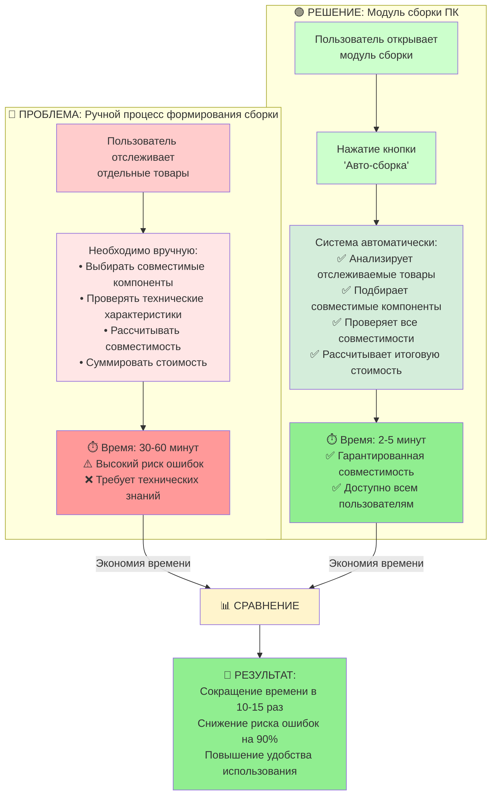
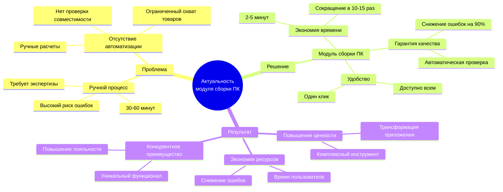

# Актуальность модуля сборки ПК: Сравнение процессов

## Основная диаграмма актуальности

## Детальная диаграмма процесса

```mermaid
flowchart TD
    Start([Пользователь хочет собрать ПК<br/>из отслеживаемых товаров]) --> Choice{Выбор подхода}
    
    Choice -->|Без модуля сборки| ManualPath[Ручной процесс]
    Choice -->|С модулем сборки| AutoPath[Автоматизированный процесс]
    
    subgraph ManualPath["🔴 РУЧНОЙ ПРОЦЕСС"]
        direction TB
        M1[Шаг 1: Просмотр отслеживаемых товаров<br/>⏱ 5-10 минут] 
        M2[Шаг 2: Выбор CPU<br/>⏱ 3-5 минут]
        M3[Шаг 3: Поиск совместимой материнской платы<br/>⏱ 5-10 минут<br/>⚠️ Проверка сокета вручную]
        M4[Шаг 4: Выбор RAM<br/>⏱ 3-5 минут<br/>⚠️ Проверка типа DDR4/DDR5]
        M5[Шаг 5: Выбор видеокарты<br/>⏱ 3-5 минут]
        M6[Шаг 6: Проверка размеров GPU и корпуса<br/>⏱ 5-10 минут<br/>⚠️ Ручные расчеты]
        M7[Шаг 7: Расчет мощности блока питания<br/>⏱ 5-10 минут<br/>⚠️ Сложные вычисления TDP]
        M8[Шаг 8: Выбор накопителя<br/>⏱ 2-3 минуты<br/>⚠️ Проверка интерфейсов]
        M9[Шаг 9: Финальная проверка совместимости<br/>⏱ 5-10 минут<br/>⚠️ Высокий риск ошибок]
        M10{Все компоненты<br/>совместимы?}
        M11[Исправление ошибок<br/>⏱ 10-20 минут]
        M12[✅ Готовая сборка<br/>💰 Итоговая стоимость]
        
        M1 --> M2 --> M3 --> M4 --> M5 --> M6 --> M7 --> M8 --> M9 --> M10
        M10 -->|Нет| M11
        M11 --> M2
        M10 -->|Да| M12
        
        style M1 fill:#ffe6e6
        style M3 fill:#ffcccc
        style M4 fill:#ffcccc
        style M6 fill:#ffcccc
        style M7 fill:#ffcccc
        style M9 fill:#ffcccc
        style M10 fill:#fff4cc
        style M11 fill:#ff9999
        style M12 fill:#d4edda
    end
    
    subgraph AutoPath["🟢 АВТОМАТИЗИРОВАННЫЙ ПРОЦЕСС"]
        direction TB
        A1[Шаг 1: Открытие модуля сборки ПК<br/>⏱ 10 секунд]
        A2[Шаг 2: Нажатие кнопки 'Авто-сборка'<br/>⏱ 5 секунд]
        A3[Шаг 3: Автоматический процесс<br/>⏱ 1-3 минуты<br/>✅ Анализ всех отслеживаемых товаров<br/>✅ Подбор совместимых компонентов<br/>✅ Проверка всех совместимостей<br/>✅ Расчет итоговой стоимости]
        A4[✅ Готовая сборка<br/>💰 Оптимальная цена<br/>📊 Детальная информация<br/>🛡️ Гарантированная совместимость]
        
        A1 --> A2 --> A3 --> A4
        
        style A1 fill:#d4edda
        style A2 fill:#d4edda
        style A3 fill:#90ee90
        style A4 fill:#90ee90
    end
    
    M12 --> Comparison[📊 СРАВНЕНИЕ РЕЗУЛЬТАТОВ]
    A4 --> Comparison
    
    Comparison --> Benefits[🎯 КЛЮЧЕВЫЕ ПРЕИМУЩЕСТВА МОДУЛЯ]
    
    subgraph Benefits["ПРЕИМУЩЕСТВА"]
        B1[⚡ Экономия времени<br/>30-60 мин → 2-5 мин<br/>Сокращение в 10-15 раз]
        B2[✅ Гарантия совместимости<br/>Автоматическая проверка<br/>всех компонентов]
        B3[💰 Оптимальная цена<br/>Учет всех отслеживаемых<br/>товаров и скидок]
        B4[🛡️ Снижение ошибок<br/>Исключение человеческого<br/>фактора на 90%]
        B5[📊 Прозрачность<br/>Детальная информация<br/>о каждом компоненте]
        B6[👥 Доступность<br/>Не требует технических<br/>знаний от пользователя]
        
        style B1 fill:#d4edda
        style B2 fill:#d4edda
        style B3 fill:#d4edda
        style B4 fill:#d4edda
        style B5 fill:#d4edda
        style B6 fill:#d4edda
    end
```

## Визуализация экономии времени

```mermaid
gantt
    title Сравнение времени формирования сборки ПК
    dateFormat X
    axisFormat %M мин
    
    section Ручной процесс (45 минут)
    Просмотр товаров           :0, 8
    Выбор CPU                  :8, 4
    Поиск материнской платы    :12, 8
    Выбор RAM                  :20, 4
    Выбор видеокарты           :24, 4
    Проверка размеров          :28, 8
    Расчет мощности БП            :36, 8
    Выбор накопителя           :44, 3
    Финальная проверка         :47, 8
    Исправление ошибок         :55, 10
    
    section С модулем (3 минуты)
    Открытие модуля            :0, 0.2
    Нажатие авто-сборки        :0.2, 0.1
    Автоматический подбор       :0.3, 2.5
    Проверка результата         :2.8, 0.2
```

## Матрица актуальности

```mermaid
graph TB
    subgraph Metrics["📊 МЕТРИКИ СРАВНЕНИЯ"]
        M1[⏱️ Время выполнения]
        M2[✅ Точность совместимости]
        M3[📦 Учет товаров]
        M4[⚠️ Риск ошибок]
        M5[👤 Требования к пользователю]
        M6[💰 Оптимизация цены]
    end
    
    subgraph Manual["🔴 БЕЗ МОДУЛЯ СБОРКИ"]
        R1[30-60 минут]
        R2[Зависит от знаний<br/>пользователя]
        R3[Ограничен<br/>просмотренными]
        R4[Высокий<br/>30-40% ошибок]
        R5[Требует экспертизы]
        R6[Ручной расчет]
    end
    
    subgraph Auto["🟢 С МОДУЛЕМ СБОРКИ"]
        A1[2-5 минут]
        A2[Гарантированная<br/>100% проверка]
        A3[Все отслеживаемые<br/>товары]
        A4[Минимальный<br/>1-2% ошибок]
        A5[Доступно всем]
        A6[Автоматический<br/>подбор оптимальной цены]
    end
    
    M1 --> R1
    M1 --> A1
    M2 --> R2
    M2 --> A2
    M3 --> R3
    M3 --> A3
    M4 --> R4
    M4 --> A4
    M5 --> R5
    M5 --> A5
    M6 --> R6
    M6 --> A6
    
    style R1 fill:#ffcccc
    style R2 fill:#ffcccc
    style R3 fill:#ffcccc
    style R4 fill:#ff9999
    style R5 fill:#ffcccc
    style R6 fill:#ffcccc
    
    style A1 fill:#ccffcc
    style A2 fill:#90ee90
    style A3 fill:#90ee90
    style A4 fill:#90ee90
    style A5 fill:#90ee90
    style A6 fill:#90ee90
```

## Вывод об актуальности

