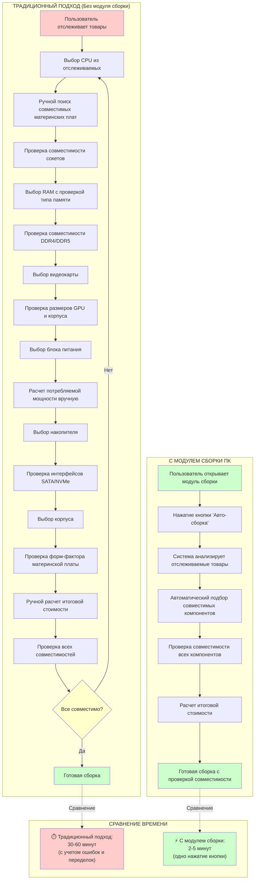
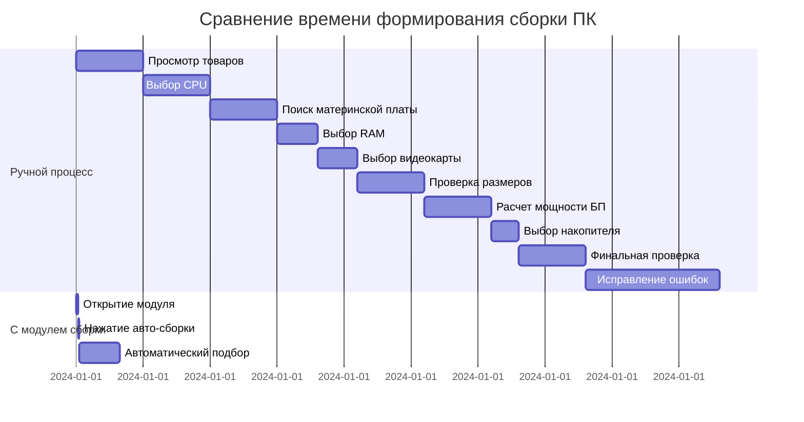
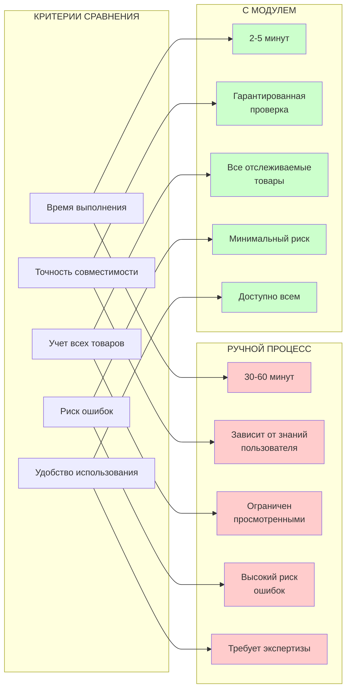
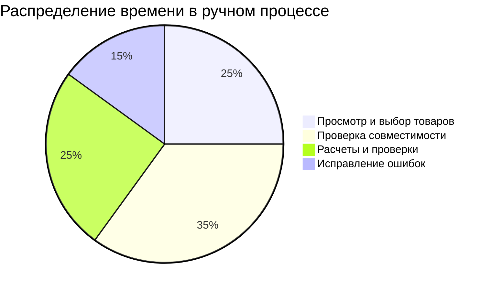
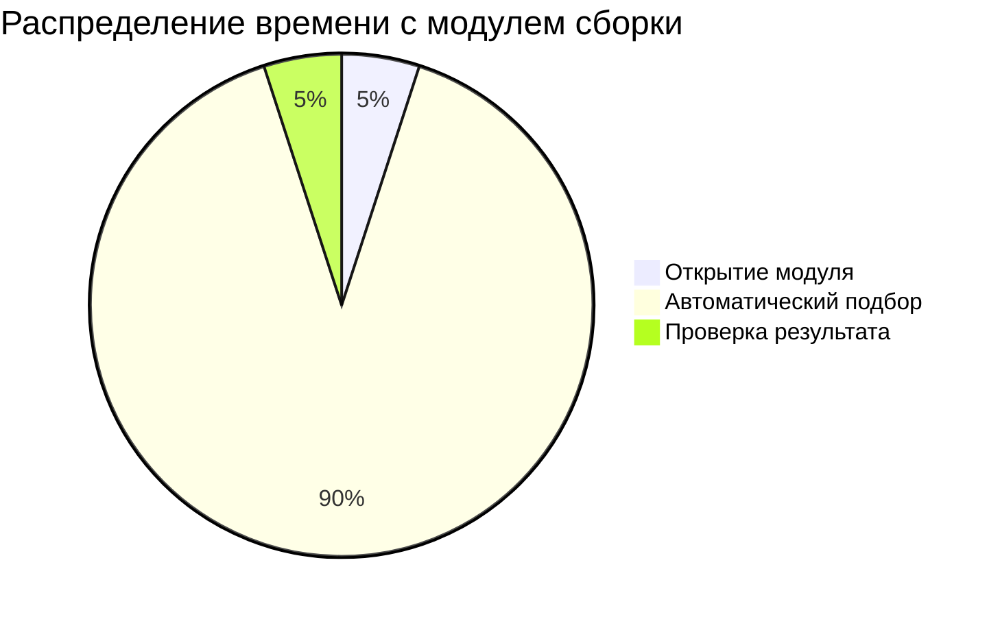

# Сравнение процессов формирования сборки ПК

## Диаграмма сравнения времени и сложности

## Детальная диаграмма процесса

```mermaid
flowchart TD
    Start([Пользователь хочет собрать ПК]) --> Choice{Выбор подхода}
    
    Choice -->|Без модуля| Manual[Ручной процесс]
    Choice -->|С модулем| Auto[Автоматизированный процесс]
    
    subgraph Manual["🔴 РУЧНОЙ ПРОЦЕСС (30-60 минут)"]
        M1[1. Просмотр отслеживаемых товаров<br/>⏱ 5-10 мин] --> M2[2. Выбор CPU<br/>⏱ 3-5 мин]
        M2 --> M3[3. Поиск совместимой материнской платы<br/>⏱ 5-10 мин<br/>⚠️ Риск ошибки совместимости]
        M3 --> M4[4. Выбор RAM с проверкой типа<br/>⏱ 3-5 мин<br/>⚠️ Проверка DDR4/DDR5]
        M4 --> M5[5. Выбор видеокарты<br/>⏱ 3-5 мин]
        M5 --> M6[6. Проверка размеров GPU/корпуса<br/>⏱ 5-10 мин<br/>⚠️ Ручные расчеты]
        M6 --> M7[7. Расчет мощности блока питания<br/>⏱ 5-10 мин<br/>⚠️ Сложные вычисления]
        M7 --> M8[8. Выбор накопителя<br/>⏱ 2-3 мин]
        M8 --> M9[9. Проверка всех совместимостей<br/>⏱ 5-10 мин<br/>⚠️ Высокий риск ошибок]
        M9 --> M10{Все совместимо?}
        M10 -->|Нет| M2
        M10 -->|Да| M11[✅ Готовая сборка<br/>💰 Итоговая стоимость рассчитана]
        
        style M1 fill:#ffe6e6
        style M3 fill:#ffe6e6
        style M6 fill:#ffe6e6
        style M7 fill:#ffe6e6
        style M9 fill:#ffe6e6
        style M10 fill:#fff4cc
        style M11 fill:#d4edda
    end
    
    subgraph Auto["🟢 АВТОМАТИЗИРОВАННЫЙ ПРОЦЕСС (2-5 минут)"]
        A1[1. Открытие модуля сборки ПК<br/>⏱ 10 сек] --> A2[2. Нажатие 'Авто-сборка'<br/>⏱ 5 сек]
        A2 --> A3[3. Система автоматически:<br/>• Анализирует отслеживаемые товары<br/>• Подбирает совместимые компоненты<br/>• Проверяет все совместимости<br/>• Рассчитывает стоимость<br/>⏱ 1-3 мин]
        A3 --> A4[✅ Готовая сборка с:<br/>• Проверкой совместимости<br/>• Расчетом стоимости<br/>• Рекомендациями<br/>💰 Оптимальная цена]
        
        style A1 fill:#d4edda
        style A2 fill:#d4edda
        style A3 fill:#d4edda
        style A4 fill:#d4edda
    end
    
    M11 --> Result[Результат]
    A4 --> Result
    
    Result --> Benefits[Преимущества модуля сборки]
    
    subgraph Benefits["🎯 КЛЮЧЕВЫЕ ПРЕИМУЩЕСТВА"]
        B1[⚡ Экономия времени:<br/>30-60 мин → 2-5 мин<br/>Сокращение в 10-15 раз]
        B2[✅ Гарантия совместимости:<br/>Автоматическая проверка<br/>всех компонентов]
        B3[💰 Оптимальная цена:<br/>Учет всех отслеживаемых<br/>товаров и скидок]
        B4[🛡️ Снижение ошибок:<br/>Исключение человеческого<br/>фактора]
        B5[📊 Прозрачность:<br/>Детальная информация<br/>о каждом компоненте]
        
        style B1 fill:#d4edda
        style B2 fill:#d4edda
        style B3 fill:#d4edda
        style B4 fill:#d4edda
        style B5 fill:#d4edda
    end
```

## Диаграмма экономии времени

## Матрица сравнения

## Статистика экономии

